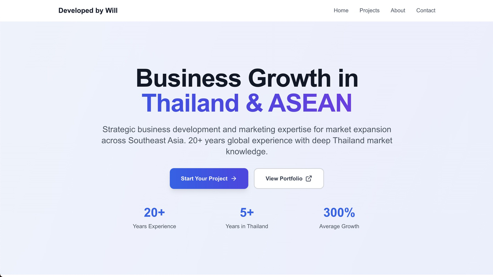
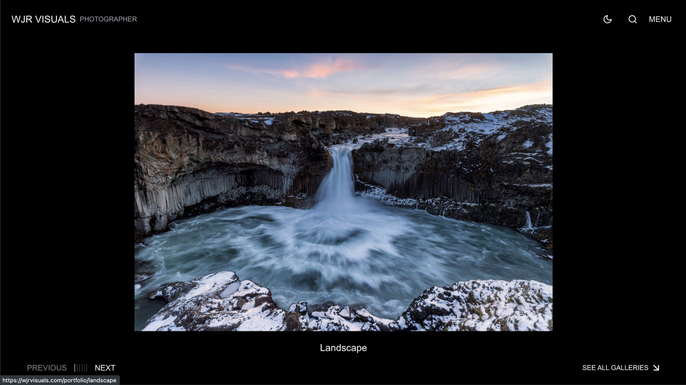
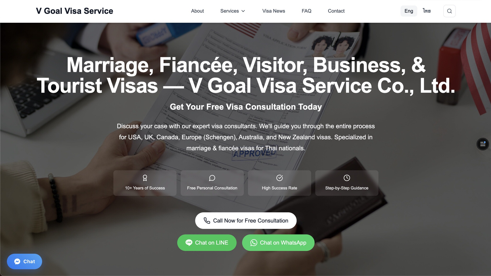
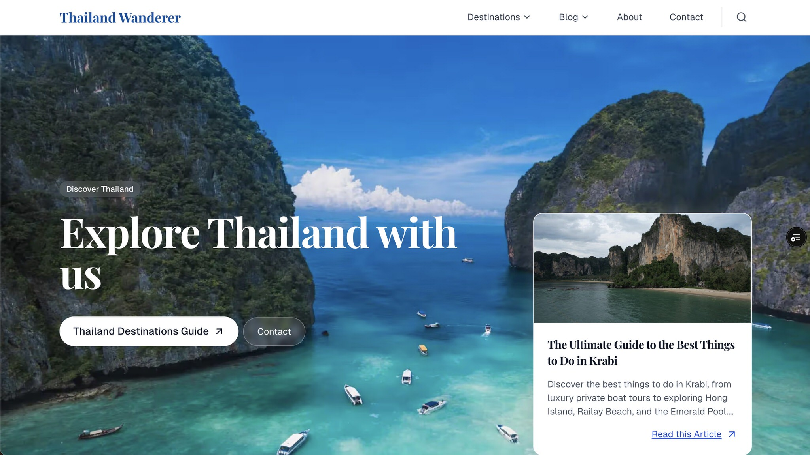

## Hi, I'm Will Reynolds!

I’m a Thailand-based business development, marketing, and operations leader with over 20 years of global experience — including more than five years living and working in Bangkok. A retired U.S. Air Force veteran, I specialize in driving operational excellence, cross-cultural stakeholder engagement, and digital growth strategies across Southeast Asia.

I’m passionate about building innovative, high-performance web solutions with clean code, modern design, and strong market impact. Whether it’s front-end development, digital marketing, or international business strategy, I bring a structured, adaptive approach tailored to the fast-evolving landscape of Thailand and the ASEAN region.

I’m currently pursuing an MBA in Bangkok, expanding my expertise in marketing, digital transformation, and strategic leadership.

---

## 💼 Key Skills & Focus Areas

- Business Development
- Marketing Strategy & Customer Engagement
- Digital Business Transformation
- International Operations & Program Leadership
- Web Development (HTML, CSS, JavaScript, Next.js)
- SEO, Analytics, & Lead Generation
- Photography & Videography (featured by The Guardian, MSN Lifestyle, U.S. Army, Photo-Weekly Germany)

Feel free to reach out — I’d love to connect, collaborate, and explore new opportunities!

---

## 🚀 Featured Projects

### Developed by Will – Personal Portfolio

**Website:** [www.DevelopedByWill.com](https://developedbywill.com)

**Description:** My personal portfolio showcasing development, design, and marketing expertise.

**Highlights:**

- Designed a modern, minimal UI/UX inspired by brands like Apple and Tesla.
- Built with Next.js, optimized for performance and SEO.
- Integrated Plausible Analytics for privacy-friendly tracking.
- Deployed on Vercel with continuous integration via GitHub Actions.

  

---

### WJR Visuals – Travel Photography Portfolio

**Website:** [www.WJRVisuals.com](https://www.WJRVisuals.com)

**Description:** A curated showcase of my global photography, capturing the beauty and diversity of cultures and landscapes.

**Highlights:**

- Designed a visually immersive, mobile-first site.
- Built responsive galleries with JavaScript lazy loading and lightbox features.
- Featured work in The Guardian, MSN Lifestyle, Institut Français des Relations Internationales, U.S. Army, Kayak, and Photo-Weekly Germany.

  

---

### V Goal Visa Service – Bilingual Business Website

**Website:** [www.VGoalVisaService.com](https://www.VGoalVisaService.com)

**Description:** A bilingual (Thai/English) visa service platform supporting clients in Bangkok with seamless navigation and clear service offerings.

**Highlights:**

- Developed a fully responsive, multi-language website.
- Used Intersection Observer API for dynamic UI effects.
- Optimized performance with lazy loading and SEO best practices.
- Supported lightweight marketing-driven design to boost conversions and leads.

  

---

### Thailand Wanderer – Strategic Travel Content Platform

**Description:**  
A strategic content platform designed to capture the growing Thailand travel market through authentic storytelling and SEO-optimized destination guides.

**Challenge:**  
Highly competitive travel blog space with established players dominating search results for Thailand-related content.

**Solution:**  
Implemented a data-driven content strategy focusing on underserved long-tail keywords, local insights, and comprehensive destination coverage.

**Focus Areas:**

- Content Strategy & Brand Development
- SEO & Market Research
- Long-tail Keyword Targeting
- Content Cluster Strategy
- Authentic Local Storytelling

**Key Results:**

- 📈 **Content Growth:** +200%
- 🗺️ **Destination Guides:** 50+ articles published
- 🔍 **SEO Wins:** Identified underserved search opportunities
- 📊 **Marketing Strategy:** Built comprehensive coverage clusters and optimized local SEO

  

---

## 🌏 Global & Regional Strength

My background includes leading strategic initiatives at U.S. embassies across Asia, Africa, and the Middle East, providing me with deep insight into cross-border operations, Southeast Asia market dynamics, and international stakeholder management.

Currently open to collaborations and opportunities in:

- Business Development
- Operations Management
- Marketing Strategy
- Digital Innovation

Let’s connect!
