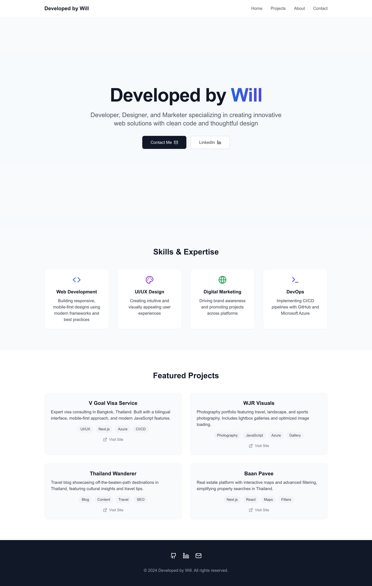

## Hi, I'm Will Reynolds!

I am a freelance Developer, Designer, and Marketer passionate about creating innovative web solutions with clean code and thoughtful design. My current focus is mastering HTML, CSS, and JavaScript—the foundation of front-end development.

With experience in managing cloud resources and deploying web applications, I specialize in ensuring smooth operations, security, and performance optimization. I enjoy solving problems, collaborating on meaningful projects, and contributing to the tech community.

Feel free to reach out—I’d love to connect, share ideas, and explore new opportunities!

## 🚀 Projects

As a developer, I've had the opportunity to work on various projects that have helped me grow my skills and expertise in the field. Below are my recent projects showcasing my ability to deliver high-quality web development solutions.

### Developed by Will - Personal Portfolio

**Website:** [www.DevelopedByWill.com](https://developedbywill.com)

**Description:** Developed by Will is my personal portfolio website that highlights my skills, projects, and expertise in web development. The site is designed to showcase my commitment to creating innovative web solutions with clean code and thoughtful design.

**My Role:**

- Designed the UI/UX for the website, emphasizing a modern and professional look.
- Built with Next.js for server-side rendering and optimized performance.
- Integrated Plausible Analytics for privacy-focused visitor tracking.
- Deployed on Vercel with a custom domain and SSL certificate.

**Knowledge & Experience Gained:**

- Mastered Next.js for static site generation and dynamic rendering.
- Implemented responsive design principles to ensure compatibility across devices.
- Enhanced SEO with metadata and structured data integration.
- Developed an efficient CI/CD pipeline using GitHub Actions.

  

---

### WJR Visuals - Travel Photography Portfolio

**Website:** [www.WJRVisuals.com](https://www.WJRVisuals.com)

**Description:** WJR Visuals is a travel photography portfolio website that showcases my passion for capturing the beauty and diversity of our planet. The website features a curated selection of my photographic work and serves as a platform to share my creative vision.

**My Role:**

- Designed the UI/UX for the website, ensuring an intuitive and visually appealing user experience.
- Developed and coded the entire website with a mobile-first approach and responsive design.
- Implemented a JavaScript function to display low-resolution thumbnails and lightboxes with higher-resolution images.
- Utilized JavaScript lazy loading to optimize loading times and improve website performance.

**Knowledge & Experience Gained:**

- Enhanced my proficiency in front-end web development, focusing on mobile-first and responsive design.
- Developed expertise in optimizing image display and using a lightbox for an enhanced user experience.
- Gained hands-on experience implementing lazy loading to boost website performance and loading speed.

  

---

### V Goal Visa Service - Bilingual Business Website

**Website:** [www.VGoalVisaService.com](https://www.VGoalVisaService.com)

**Description:** V Goal Visa Service is a bilingual business website serving clients in Bangkok, Thailand. Accessible in both Thai and English, the website provides information about visa services and offers an intuitive user experience.

**My Role:**

- Designed the UI/UX for the website, ensuring an intuitive and visually appealing user experience.
- Developed and coded a fully responsive, bilingual website with a mobile-first approach.
- Utilized the Intersection Observer API to manage the navigation bar while scrolling.
- Implemented JavaScript lazy loading to optimize website loading times.

**Knowledge & Experience Gained:**

- Gained experience building bilingual and multi-language websites with responsive and mobile-first design.
- Learned how to use the Intersection Observer API to create dynamic and interactive navigation experiences.
- Gained expertise in using lazy loading techniques to enhance website performance.

These projects reflect my commitment to continuous learning and my desire to create meaningful solutions that make a positive impact. I'm excited to continue exploring new technologies and taking on new challenges in software development.

  

