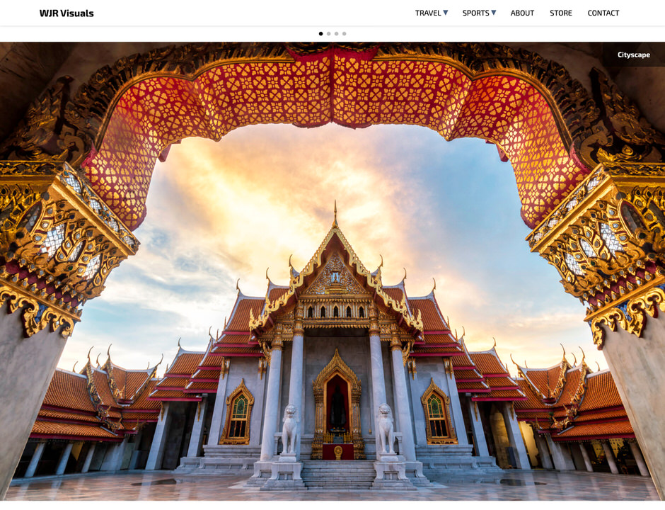
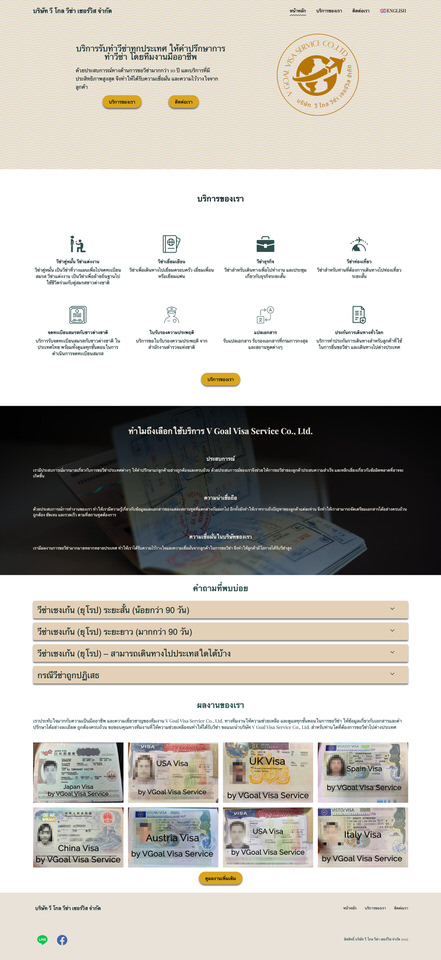

## Hi, I'm Will Reynolds!

As an Air Force veteran, I've had the incredible opportunity to serve my country and embark on numerous adventures. Now, I'm on a new journey, transitioning from my passion for photography to the exciting world of software development.

My current focus is on HTML, CSS, and JavaScript—three pillars of front-end development that I'm eager to master.

Alongside my web development studies, I'm also Microsoft Azure Administrator Certified. I have experience managing Azure resources and overseeing the deployment and maintenance of web applications on the Azure platform. Additionally, I'm responsible for ensuring the smooth operation and security of these resources.

My goal is to leverage my diverse skillset and love for problem-solving to create innovative solutions that make a positive impact. In addition, I'm excited to connect with like-minded individuals, collaborate on meaningful projects, and contribute to the tech community.

Feel free to contact me—I'd love to chat, share ideas, and explore opportunities for collaboration!

## 🚀 Projects

As a developer, I've had the opportunity to work on various projects that have helped me grow my skills and expertise in the field. Below are two of my recent projects showcasing my ability to deliver high-quality web development solutions.

### WJR Visuals - Travel Photography Portfolio

**Website:** [www.WJRVisuals.com](https://www.WJRVisuals.com)

**Description:** WJR Visuals is a travel photography portfolio website that showcases my passion for capturing the beauty and diversity of our planet. The website features a curated selection of my photographic work and serves as a platform to share my creative vision.

**My Role:**

- Designed the UI/UX for the website, ensuring an intuitive and visually appealing user experience.
- Developed and coded the entire website with a mobile-first approach and responsive design.
- Implemented a JavaScript function to display low-resolution thumbnails and lightboxes with higher-resolution images.
- Utilized JavaScript lazy loading to optimize loading times and improve website performance.

**Knowledge & Experience Gained:**

- Enhanced my proficiency in front-end web development, focusing on mobile-first and responsive design.
- Developed expertise in optimizing image display and using a lightbox for an enhanced user experience.
- Gained hands-on experience implementing lazy loading to boost website performance and loading speed.

  

---

### V Goal Visa Service - Bilingual Business Website

**Website:** [www.VGoalVisaService.com](https://www.VGoalVisaService.com)

**Description:** V Goal Visa Service is a bilingual business website serving clients in Bangkok, Thailand. Accessible in both Thai and English, the website provides information about visa services and offers an intuitive user experience.

**My Role:**

- Designed the UI/UX for the website, ensuring an intuitive and visually appealing user experience.
- Developed and coded a fully responsive, bilingual website with a mobile-first approach.
- Utilized the Intersection Observer API to manage the navigation bar while scrolling.
- Implemented JavaScript lazy loading to optimize website loading times.

**Knowledge & Experience Gained:**

- Gained experience building bilingual and multi-language websites with responsive and mobile-first design.
- Learned how to use the Intersection Observer API to create dynamic and interactive navigation experiences.
- Gained expertise in using lazy loading techniques to enhance website performance.

These projects reflect my commitment to continuous learning and my desire to create meaningful solutions that make a positive impact. I'm excited to continue exploring new technologies and taking on new challenges in software development.

  

